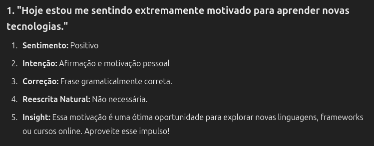

# Projeto de Análise de Sentenças com IA

## 📌 Descrição
Este projeto foi desenvolvido como parte do curso da DIO para reforçar os conceitos aprendidos sobre Inteligência Artificial e análise de linguagem natural.

## 🧠 Funcionalidades
- Leitura de sentenças a partir de um arquivo `.txt`
- Análise das frases usando um modelo de IA
- Geração de insights a partir das sentenças

## 💡 Insights
Durante o desenvolvimento deste projeto, aprendi:
- Como a IA pode ser usada para extrair valor de textos simples.
- A importância de estruturar bem os dados de entrada.
- Como documentar projetos de forma clara para portfólio.

## 📸 Prints
*Abaixo alguns prints do processo:*

